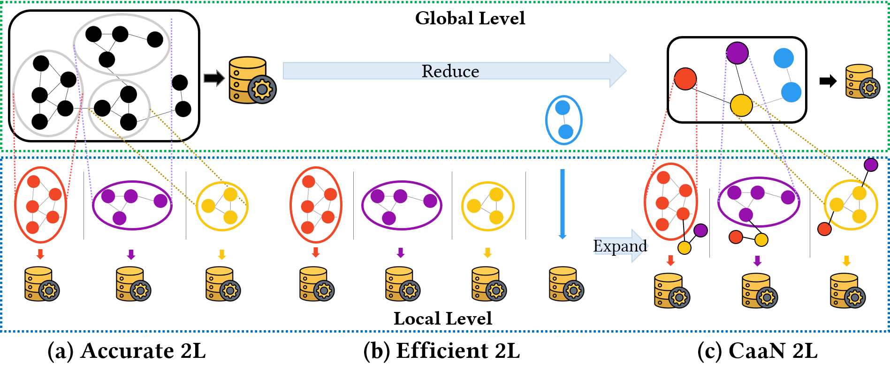

# Two-Level Graph Representation Learning with Community-as-a-Node Graphs (ICDM2023)

The source code for the paper "Two-Level Graph Representation Learning with Community-as-a-Node Graphs", which was presented at ICDM 2023.

*The basic concept of Two-Level GRL with Community-as-a-Node (CaaN 2L-GRL).*

## Abstract

> In this paper, we propose a novel graph representation learning (GRL) model that aims to improve both representation accuracy and learning efficiency. We design a Two-Level GRL architecture based on the graph partitioning: 1) local GRL on nodes within each partitioned subgraph and 2) global GRL on subgraphs. By partitioning the graph through community detection, we enable elaborate node learning in the same community. Based on Two-Level GRL, we introduce an abstracted graph, Community-as-a-Node Graph (CaaN), to effectively maintain the high-level structure with a significantly reduced graph. By applying the CaaN graph to local and global GRL, we propose Two-Level GRL with Community-as-a-Node (CaaN 2L) that effectively maintains the global structure of the entire graph while accurately representing the nodes in each community. A salient point of the proposed model is that it can be applied to any existing GRL model by adopting it as the base model for local and global GRL. Through extensive experiments employing seven popular GRL models, we show that our model outperforms them in both accuracy and efficiency.

## Requirements
- python==3.6.13
- gensim==3.8.3
- igraph==0.9.11
- keras==2.6.0
- matplotlib==3.3.4
- networkx==2.5.1
- numpy==1.19.5
- pandas==1.1.5
- scikit-learn==0.24.2
- scipy==1.5.4
- stellargraph==1.2.1
- tensorflow==2.6.2

## Implementation

In experiments, the source code for the three baseline models: [CNRL](https://arxiv.org/abs/1611.06645), [AnECI](https://ieeexplore.ieee.org/document/9835662), [GCA](https://dl.acm.org/doi/abs/10.1145/3442381.3449802)

is in the folders `models/CNRL`, `models/AnECI`, and `models/GCA`, respectively.

For a detailed description of running the model, see the original GitHub repository.

1. [CNRL](http://nlp.csai.tsinghua.edu.cn/%7Etcc/datasets/simplified_CNRL.zip) (TKDE 2018)

2. [AnECI](https://github.com/Gmrylbx/AnECI) (ICDE 2022)

3. [GCA](https://github.com/CRIPAC-DIG/GCA) (WWW 2021)

All other models' source codes in the paper are in the `codes` folder.

4. [Node2Vec](https://github.com/bigbases/Two-level-GRL/blob/master/codes/node2vec.py) (SIGKDD 2016)

5. [GCN](https://github.com/bigbases/Two-level-GRL/blob/master/codes/gcn.py) (ICLR 2017)

6. [GraphSAGE](https://github.com/bigbases/Two-level-GRL/blob/master/codes/graphsage.py) (NIPS 2017)

7. [GAT](https://github.com/bigbases/Two-level-GRL/blob/master/codes/gat.py) (ICLR 2018)

## Dataset

Datasets used in this study is provided in `datasets`

1. [Foursquare](https://sites.google.com/site/yangdingqi/home/foursquare-dataset)

2. [Flickr](https://www.kaggle.com/datasets/hsankesara/flickr-image-dataset)

3. [YouTube](https://snap.stanford.edu/data/com-Youtube.html)

Other datasets can be obtained from [stellargraph library](https://stellargraph.readthedocs.io/en/v0.9.0/_modules/stellargraph/datasets/datasets.html). 

4. [PubMed](https://stellargraph.readthedocs.io/en/v1.0.0rc1/_modules/stellargraph/datasets/datasets.html#PubMedDiabetes)

5. [CiteSeer](https://stellargraph.readthedocs.io/en/v1.0.0rc1/_modules/stellargraph/datasets/datasets.html#CiteSeer)

   
## Getting the code

You can download a copy of all the files in this repository by cloning the
[git](https://git-scm.com/) repository:

    https://github.com/parkjungha/Two-level-GRL.git

or download a zip archive.

## Dependencies

You'll need a working Python environment to run the code.
The recommended way to set up your environment is through the
[Anaconda Python distribution](https://www.anaconda.com/download/) which
provides the `conda` package manager.
Anaconda can be installed in your user directory and does not interfere with
the system Python installation.
The required dependencies are specified in the file `environment.yml`.

We use `conda` virtual environments to manage the project dependencies in
isolation.
Thus, you can install our dependencies without causing conflicts with your
setup (even with different Python versions).

Run the following command in the repository folder (where `environment.yml`
is located) to create a separate environment and install all required
dependencies in it:

    conda env create
    source activate [name]
    conda env export > environment.yaml

## Environments

We use Intel Xeon Silver 4210R 20-core CPU @ 2.40 GHz and 32 GB RAM running on Ubuntu 18.04.6 LTS.

## Implementation

### How to run CaaN 2L GRL

    python main.py --dataset PubMed --size_thresh 100 --model gcn --task node --cd_algo LP
    
### Hyperparameters
The following Options can be passed to `main.py`

`--dataset`: Name of the dataset. (Supported names are: Foursquare, Flickr, PubMed, and CiteSeer.)

`--size_thresh`: Threshold value which is the minimum number of nodes to be defined as major communities.

`--model`: Name of base GRL model to use. (Supported names are: gcn, graphsage, gat, and node2vec.)

`--task`: Type of downstream task: node classification or link prediction

`--cd_algo`: Name of the community detection algorithm to use (Supported names are: LP, MM, EG, RW, and IM.)

All other codes can be found in the `codes` folder via [Jupyter notebooks](http://jupyter.org/).
